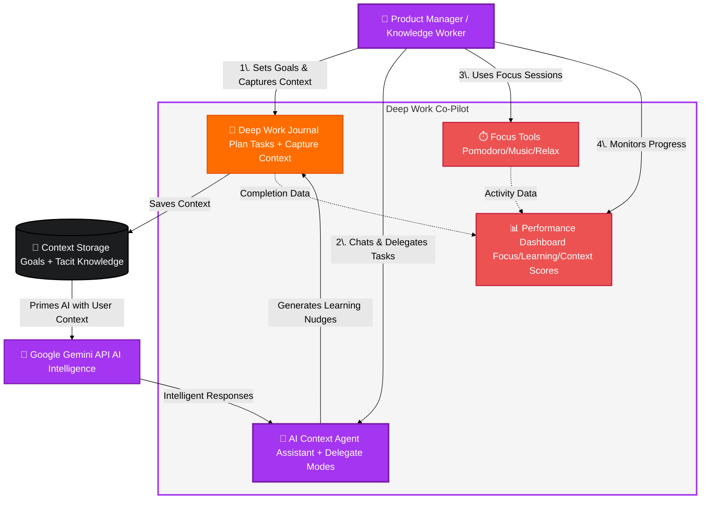
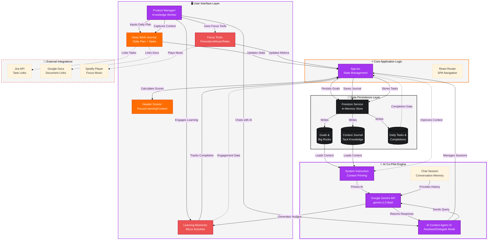

# PM's Deep Work Co-Pilot

The PM's Deep Work Co-Pilot is an intelligent web application designed to help Product Managers and other knowledge workers structure their day for focused, strategic work. It acts as an AI partner, facilitating a "virtuous context loop" where the user provides goals and tacit knowledge, and the AI provides tailored assistance, learning nudges, and task delegation capabilities.

## Table of Contents
1.  [Product Requirements](#product-requirements)
    - [Vision & Goal](#vision--goal)
    - [Target Audience](#target-audience)
    - [Core Problem](#core-problem)
    - [Key Features](#key-features)
2.  [UI/UX Design](#uiux-design)
    - [Design Philosophy](#design-philosophy)
    - [Layout](#layout)
    - [Key Components](#key-components)
3.  [Technical Design & Architecture](#technical-design--architecture)
    - [Tech Stack](#tech-stack)
    - [Project Structure](#project-structure)
    - [System Design](#system-design)
    - [The Virtuous Context Loop](#the-virtuous-context-loop)

---

## Product Requirements

### Vision & Goal
To create an AI-powered co-pilot that empowers knowledge workers to combat distraction, foster deep work, and enhance their strategic thinking skills. The application aims to move beyond simple task management to become an active partner in achieving daily professional goals.

### Target Audience
-   **Primary:** Product Managers (PMs) who need to balance tactical execution with long-term strategic planning.
-   **Secondary:** Program Managers, UX Designers, Engineers, and any knowledge worker whose role demands periods of intense, focused effort.

### Core Problem
Modern knowledge workers are constantly bombarded with notifications and context-switching demands, making it difficult to allocate meaningful time for "deep work." Planning a focused day is hard, and existing tools often add to the cognitive load rather than reducing it.

### Key Features
-   **Daily Plan Management:** Users can define a primary "big rock" task and several smaller tasks for the day. Tasks can be linked to external sources like Jira or Google Docs and checked off upon completion.
-   **Context-Aware AI Co-Pilot:**
    -   **Assistant Mode:** An always-available chat assistant for brainstorming, asking questions, and refining ideas.
    -   **Delegate Mode:** After locking in a daily plan, the user can delegate specific, context-heavy tasks (e.g., "Draft a value proposition") to the AI.
-   **Context Capture Journal:** A private, free-form text area where users can input "tacit knowledge"—internal thoughts, assumptions, and proprietary context—that the AI uses to inform its responses.
-   **Dynamic Learning Moments:** Based on the user's "big rock" task, the app automatically generates 1-3 relevant micro-learning activities (e.g., articles, videos) to sharpen relevant skills.
-   **Focus Tools:** A dedicated UI panel includes:
    -   A **Pomodoro Timer** to structure work/break intervals.
    -   A **Mindful Relaxation** prompt.
    -   A minimalist **Spotify Player** integration for focus music.
-   **Real-time Performance Dashboard:**
    -   **Focus Score:** Rates the quality of the daily plan. A high score is achieved with one "big rock" and a minimal number of other tasks.
    -   **Learning Score:** Tracks the completion percentage of the day's learning activities.
    -   **Context Meter:** Fills up as the user provides more information in their journal, visualizing how much context the AI has to work with.

---

## UI/UX Design

### Design Philosophy
-   **Focus-Oriented:** A dark-themed, minimalist, and clutter-free interface designed to minimize distractions.
-   **Informative & Actionable:** Key metrics are always visible but unobtrusive. UI elements are intuitive and provide clear affordances for interaction.
-   **Seamless Experience:** Smooth transitions and animations guide the user through the workflow, from planning to execution.

### Layout
The application uses a responsive, multi-panel layout:
1.  **Header:** A slim, persistent header contains the application title and the three core performance scores (Focus, Learning, Context).
2.  **Center Panel (Deep Work Journal):** The user's primary workspace. It houses the daily plan, learning moments, focus tools, and the context capture journal. This panel is always visible.
3.  **Right Panel (AI Context Agent):** A collapsible panel for all AI interactions. It features a toggle between "Delegate" and "Assistant" modes, a chat history view, and an input field.

### Key Components
-   `HeaderScores`: Provides an at-a-glance dashboard of the user's performance metrics.
-   `DeepWorkJournal`: The central hub for user input, combining task lists, learning activities, and the journal.
-   `FocusTools`: A self-contained, tabbed widget for managing focus sessions.
-   `AIContextAgent`: The primary interface for all Gemini-powered interactions, ensuring a clear separation between user planning and AI collaboration.

---

## Technical Design & Architecture

### Tech Stack
-   **Frontend:** React (v19) with TypeScript, Vite
-   **Styling:** Tailwind CSS
-   **AI Model:** Google Gemini API (`gemini-2.5-flash`) via the `@google/genai` SDK
-   **Backend (Simulated):** An in-memory key-value store (`firestoreService.ts`) simulates Firestore database interactions for persisting goals and journal entries without requiring a real backend.

### Project Structure
```
/
├── public/
├── src/
│   ├── components/       # Reusable React components (icons, cards, etc.)
│   ├── services/         # Modules for external interactions (e.g., firestoreService.ts)
│   ├── App.tsx           # Main application component, handles state and logic
│   ├── index.tsx         # React root entry point
│   └── types.ts          # Centralized TypeScript type definitions
├── index.html            # HTML entry point
├── README.md             # This file
└── ... (config files)
```

### System Design

The application is a client-side single-page application (SPA) that interacts with two primary external systems: the simulated Firestore database for state persistence and the Google Gemini API for intelligence.

#### Data Flow Diagram




### The Virtuous Context Loop
This is the core concept driving the application's unique value.

1.  **Context Input:** The user defines a high-level goal (the "big rock" task) and provides detailed, private thoughts in the "Context Capture Journal."
2.  **Context Persistence:** This information is saved via the `firestoreService`.
3.  **AI Priming:** When the daily plan is locked in, the application initializes a new `Chat` instance with the Gemini API. The goal and journal entry are used to construct a highly specific `systemInstruction`, priming the AI with the user's unique context.
4.  **Contextual Interaction:** All subsequent interactions in both "Assistant" and "Delegate" mode are now deeply informed by this context, leading to more relevant and valuable AI responses.
5.  **Feedback & Iteration:** The AI provides drafts and learning nudges. The user's engagement with these (e.g., completing learning activities) is tracked, closing the loop and reinforcing the deep work cycle.